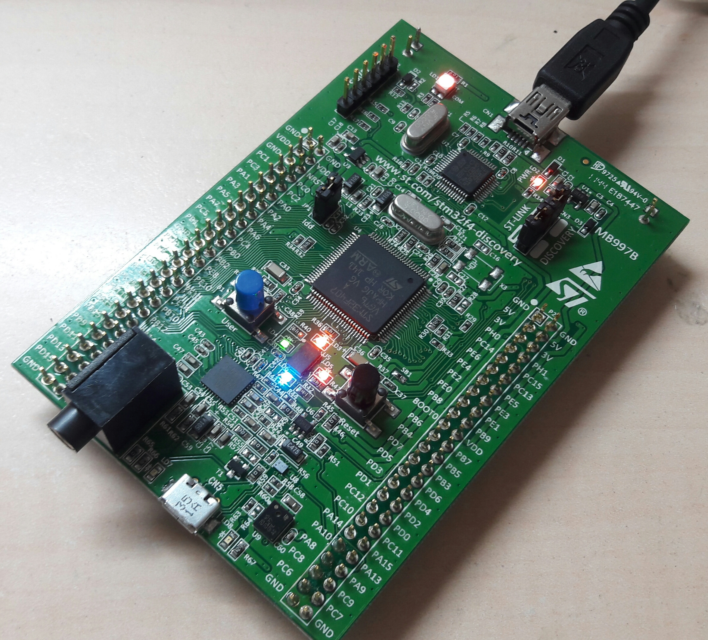

## stm32f4 examples

Some simple STM32F4 programs for beginners.

STM32f4-Discovery board was used.



### Peripheral manipulation
* GPIO Output
* PWM
* USART
  * w/o DMA
  * w/ DMA
  * Type command **sudo screen /dev/ttyUSB0 9600** to test the program
* Systick

### FreeRTOS (using real-time operating system on STM32)
* Task creation
* Semaphore
* Queue

## Fix premission denied when using USB-TTL device

Add user into the UNIX dialout group:

`sudo gpasswd --add username dialout`

## Developing environment setup

This tutorial provide you the way to setup the environment (toolchain, on-chop debugger, flash program, etc) for STM32 development.

### 0. Prerequisite

```sudo apt-get install build-essential git zlib1g-dev libsdl1.2-dev automake* autoconf* libtool libpixman-1-dev lib32gcc1 lib32ncurses5 libc6:i386 libncurses5:i386 libstdc++6:i386 libusb-1.0.0-dev```

### 1. openocd

OpenOCD is a free on-chip debugger, you can use it for firmware flashing or debugging.

```
git clone git://git.code.sf.net/p/openocd/code openocd
cd openocd
./bootstrap
./configure --prefix=/usr/local  --enable-jlink --enable-amtjtagaccel --enable-buspirate  --enable-stlink   --disable-libftdi
echo -e "all:\ninstall:" > doc/Makefile
make
sudo make install
```

### 2. st-link

As an alternation of OpenOCD, you could use ST-Link, which is provided by STMicroelectronics.

```
git clone http://github.com/texane/stlink.git
cd stlink
./autogen.sh
./configure --prefix=/usr
make
sudo make install
sudo cp 49-stlinkv2.rules /etc/udev/rules.d/
```

### 3. Toolchain (cross compiler, debugger, etc...)

1. download and extract the archive

```
cd ~
wget https://launchpadlibrarian.net/186124160/gcc-arm-none-eabi-4_8-2014q3-20140805-linux.tar.bz2
tar -jxf gcc-arm-none-eabi-4_8-2014q3-20140805-linux.tar.bz2
rm gcc-arm-none-eabi-4_8-2014q3-20140805-linux.tar.bz2
```

2. set profile

open`~/.bashrc` and paste:

```
PATH=$PATH:~/gcc-arm-none-eabi-4_8-2014q3/bin
export PATH
```

3. restart the terminal then you are ready to go

### References

* NCKU Wikipedia: http://wiki.csie.ncku.edu.tw/embedded/Lab25
